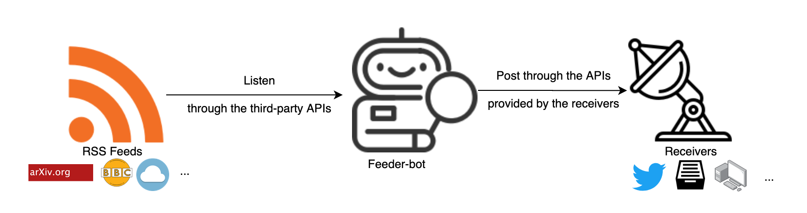

# Feeder-Bot
 This is a tool called **feeder-bot** for automating updates of RSS feeds to your platform (receiver). The workflow of feeder-bot is illustrated as follows.


### Quick Start

Here using arXiv as the RSS feed and Twitter as the receiver, for example.

#### Direct Download

``````shell
git clone https://github.com/wangcongcong123/feeder-bot.git
cd feeder-bot
vim twitter_keys.txt
``````
The content of twitter_keys.txt should be as follows.

	TWITTER_KEY=<YOURS>
	TWITTER_SECRET=<YOURS>
	TWITTER_APP_KEY=<YOURS>
	TWITTER_APP_SECRET=<YOURS>

##### Requirements

``````shell
pip install -r requirements.txt
``````

##### Run [arxiv_twitter.py](/arxiv_twitter.py)

``````shell
python arxiv_twitter.py -r 3600 -q "bert+OR+nlp" -d 10
``````
or

``````shell
python arxiv_twitter.py --arxiv_query "COVID-19"  --hashtags_prepend "#COVID-19"
``````

Where `python arxiv_twitter.py -h`

``````html
usage: arxiv_twitter.py [-h] [-r REQUEST_INTERVAL] [-q ARXIV_QUERY]
                        [-d DAYS_SINCE] [-t HASHTAGS_PREPEND]

optional arguments:
  -h, --help            show this help message and exit
  -r REQUEST_INTERVAL, --request_interval REQUEST_INTERVAL
                        The request_interval (Default: 3600) means sending
                        request to arxiv api every seconds of
                        request_interval.
  -q ARXIV_QUERY, --arxiv_query ARXIV_QUERY
                        The arxiv_query (default: 'nlp+OR+bert') is specified
                        for automatic retreival of latest papers from arxiv.
                        Space should be replaced with '+'. More refers to:
                        https://arxiv.org/help/api.
  -d DAYS_SINCE, --days_since DAYS_SINCE
                        The days_since (default: 10) defines the number of
                        past days since considered to be an update, e.g., 10
                        means that ony the papers on ariXv with the update
                        date no more than 10 days ago are considered to be
                        forwarded and posted to Twitter.
  -t HASHTAGS_PREPEND, --hashtags_prepend HASHTAGS_PREPEND
                        The list of hashtags (default:
                        '#NLP,#MachineLearning') you want to prepend the
                        tweet, seperated by ','.
``````

#### Docker Image

``````shell
docker pull a1243324336/feeder-bot:arxiv_twitter
vim twitter_keys.txt
``````

The content of twitter_keys.txt should be as follows.

	TWITTER_KEY=<YOURS>
	TWITTER_SECRET=<YOURS>
	TWITTER_APP_KEY=<YOURS>
	TWITTER_APP_SECRET=<YOURS>

##### Run in Container

``````shell
docker run -v $(pwd)/twitter_keys.txt:/feeder-bot/twitter_keys.txt feeder-bot:arxiv_twitter arxiv_twitter.py -r 3600 -q "bert+OR+nlp" -d 10
``````
or

``````shell
docker run -v $(pwd)/twitter_keys.txt:/feeder-bot/twitter_keys.txt feeder-bot:arxiv_twitter arxiv_twitter.py --arxiv_query "COVID-19"  --hashtags_prepend "#COVID-19"
``````

### Support of RSS feeds so far

- [arXiv](https://arxiv.org/)

### Support of receivers so far

- [Twitter](https://twitter.com/home)

### Examples

- [How to listen to arXiv based on keywords and post identified updates to Twitter?](https://wangcongcong123.github.io./How-to-listen-to-arXiv-based-on-keywords-and-post-identified-updates-to-Twitter/)

### TODO
- Support more RSS feeds such as BBC News, Weather, etc.
- Support more receivers such as inbox, website, etc.

### Updates

- 13/03/2020: Publish the first version of feeder-bot that can listen to updates from arXiv and automatically forward them to Twitter if updates found. You just need to specify some arguments such as arxiv_query and hashtags_prepend to run the bot !


### Contributions
- Now the project is just in early stage, so feedback and pull requests are welcome.


